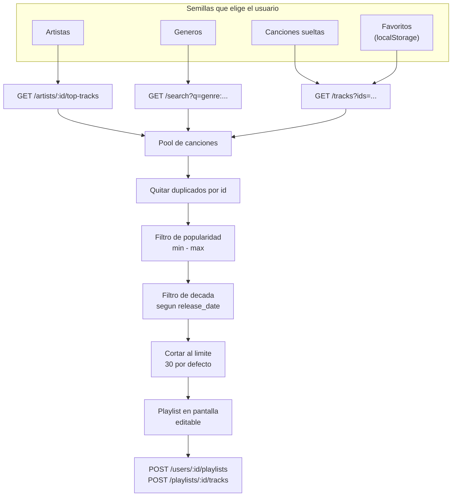
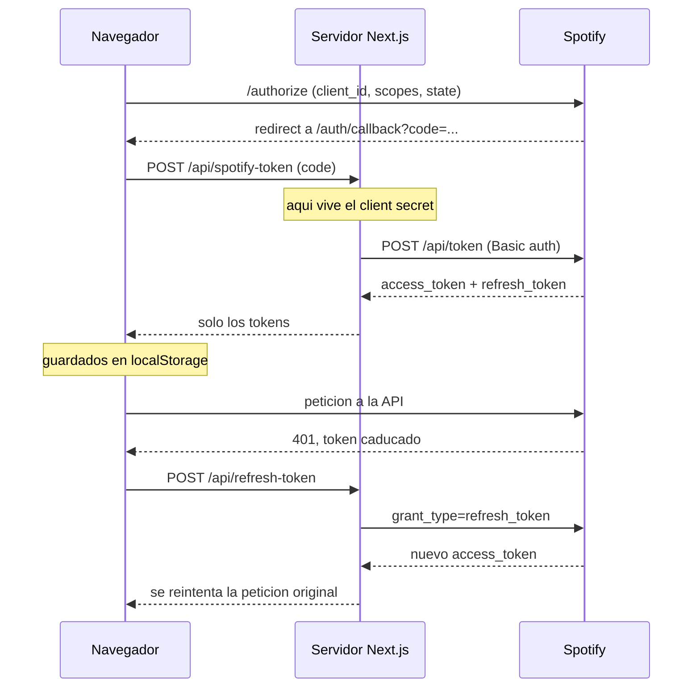

# Pinchadiscos

*Le dices el ambiente, el te pincha la sesion.*

Aplicacion web en Next.js que construye playlists de Spotify a partir de unos cuantos filtros: artistas, generos, decadas, popularidad y numero de canciones. La playlist se puede revisar en el navegador y guardarla despues en la cuenta real del usuario.

Proyecto final de la asignatura de Programacion Web (UTAD).

## Que hace

* Login con Spotify mediante OAuth 2.0 (authorization code) con refresco automatico del token.
* Widgets de busqueda para elegir artistas y canciones concretas, con autocompletado sobre la API de Spotify.
* Filtros por genero (19 disponibles), por decada (de los 70 a los 2020) y por rango de popularidad.
* Generacion de la playlist combinando las semillas elegidas, quitando duplicados y aplicando los filtros en local.
* Marcar canciones como favoritas (se guardan en el navegador) para que entren en las siguientes generaciones.
* Anadir mas canciones, quitar las que no encajen y guardar el resultado como playlist nueva en Spotify.

## Como funciona

Spotify retiro el endpoint de recomendaciones, asi que Pinchadiscos no le pide la playlist hecha: lanza varias busquedas en paralelo a partir de las semillas que eliges, junta todo en un pool y aplica los filtros en local.



El client secret nunca llega al navegador: el intercambio del codigo por tokens y el refresco pasan por rutas de servidor.



## Stack

Next.js 16 (App Router), React 19, Tailwind CSS 4 y la Spotify Web API. El intercambio de tokens pasa por dos rutas de servidor (`/api/spotify-token` y `/api/refresh-token`) para no exponer el client secret en el navegador.

## Puesta en marcha

Necesitas Node.js 18 o superior y una app creada en el [dashboard de desarrollador de Spotify](https://developer.spotify.com/dashboard).

En la configuracion de la app de Spotify, anade esta Redirect URI:

```
http://127.0.0.1:3000/auth/callback
```

Luego, en el proyecto:

```bash
npm install
cp .env.example .env.local
```

Rellena `.env.local` con las credenciales de tu app:

```
SPOTIFY_CLIENT_ID=...
SPOTIFY_CLIENT_SECRET=...
NEXT_PUBLIC_SPOTIFY_CLIENT_ID=...
NEXT_PUBLIC_REDIRECT_URI=http://127.0.0.1:3000/auth/callback
```

Y arranca el servidor:

```bash
npm run dev
```

La app queda en `http://127.0.0.1:3000`. Ten en cuenta que las apps de Spotify en modo desarrollo solo funcionan con las cuentas que anadas manualmente en la seccion Users del dashboard.

## Estructura

```
src/
  app/
    page.js               pantalla de login
    dashboard/            pantalla principal con los filtros y la playlist
    auth/callback/        recibe el codigo de Spotify y lo cambia por el token
    api/                  rutas de servidor para pedir y refrescar tokens
  components/
    widgets/              un componente por filtro
    TrackCard.jsx         tarjeta de cancion con favorito, preview y borrado
    PlaylistDisplay.jsx   listado de la playlist generada
  lib/
    auth.js               OAuth, guardado del token y refresco
    spotify.js            llamadas a la API y logica de generacion
    favorites.js          favoritos en localStorage
```

## Limitaciones conocidas

* El filtro de mood (`MoodWidget`) se quedo sin conectar a la generacion. Spotify retiro el endpoint de audio features que hacia falta para calcularlo, asi que el componente esta en el repo pero no se usa.
* La preview de audio depende de `preview_url`, que Spotify ya no devuelve para todas las canciones. Cuando falta, el boton avisa de que no hay preview.
* Los favoritos viven en el `localStorage` del navegador, no en la cuenta de Spotify.

## Licencia

MIT. Ver [LICENSE](LICENSE).
